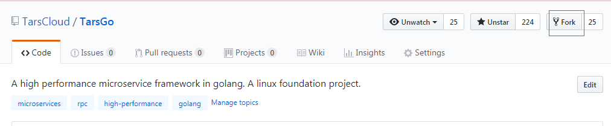

# Contributing to TarsGo


## 1 Create an issue 
  
if u want to report a bug, use this template in issue:
```
**Describe the bug**
A clear and concise description of what the bug is.

**To Reproduce**
Steps to reproduce the behavior:
 
** Version info 
Which go version :
Which tars version (git commit id or branch name):
Which  os:

**Expected behavior**
A clear and concise description of what you expected to happen.

**Additional context**
Add any other context about the problem here.
```
 if u want to propose a feature ,use this template in issue :
```
**Is your feature request related to a problem? Please describe.**
A clear and concise description of what the problem is. Ex. I'm always frustrated when [...]

**Describe the solution you'd like**
A clear and concise description of what you want to happen.

**Describe alternatives you've considered**
A clear and concise description of any alternative solutions or features you've considered.

**Additional context**
Add any other context or screenshots about the feature request here.

```

## 2 fork the project
click the fork button on the right top of the project.


## 3 create a pull request
if u want to create a pull request ,u must create a issue first . 
In the pr , u should give the related issue.  
All pull request must go to dev branch , not master.


## 4 AUTHORS
After ur pr is merged , ur name and github email will be showed in AUTHORS like following.
```
# This file lists all individuals having contributed content to the repository.
# For how it is generated, see `hack/generate-authors.sh`.

ChenMingjie <15210875043@sina.cn>
sandyskies <chenmingjie0828@163.com>
Tim Xu <xiaoxubeii@gmail.com>
titustian <titustian@tencent.com>

```
