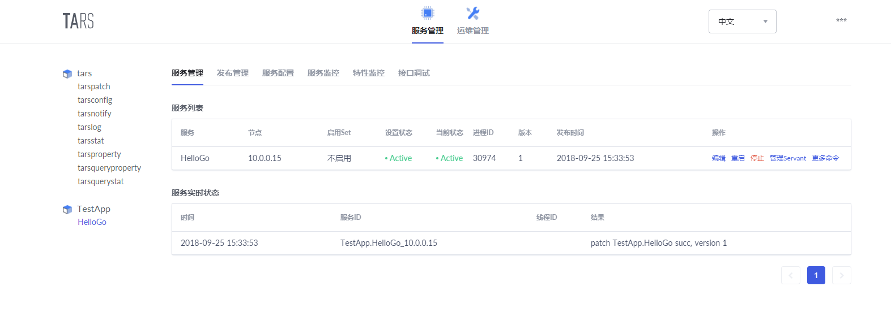
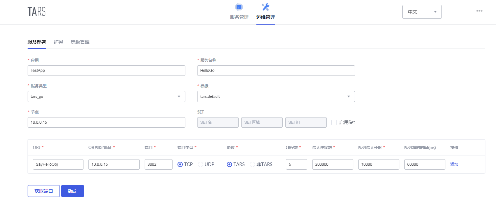
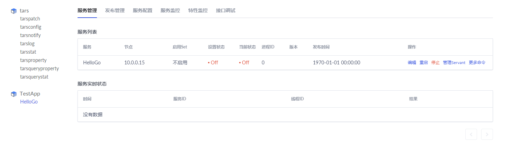
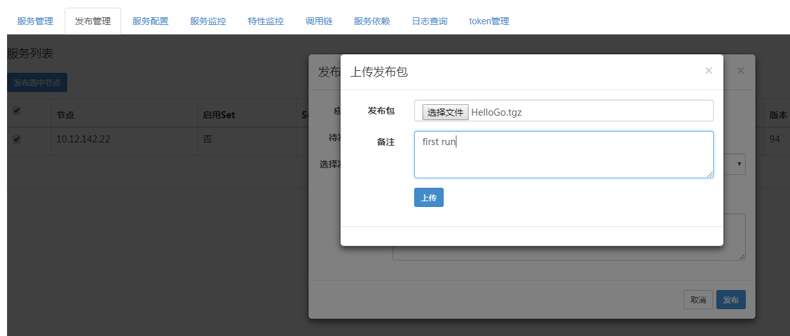
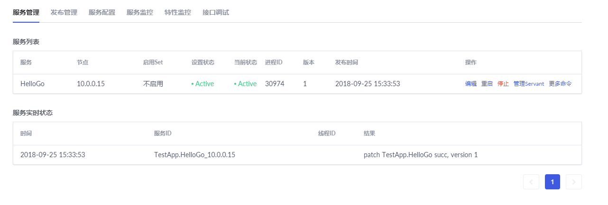

# Tars Go快速指南

## 环境搭建

tars基础组件安装参考[部署](https://github.com/TarsCloud/Tars/tree/master/deploy)

Golang环境准备，tarsgo要求golang版本在1.9.x及以上。

安装tars： `go get github.com/TarsCloud/TarsGo/tars `

编译tars协议转Golang工具：

```shell
cd $GOPATH/src/github.com/TarsCloud/TarsGo/tars/tools/tars2go && go build . 

cp tars2go $GOPATH/bin/
```

检查下GOPATH路径下tars是否安装成功。

## 服务命名

使用Tars框架的服务，服务名称由三个部分组成：

- APP： 应用名，标识一组服务的一个小集合，在Tars系统中，应用名必须唯一。例如：TestApp；

- Server： 服务名，提供服务的进程名称，Server名字根据业务服务功能命名，一般命名为：XXServer，例如HelloServer；

- Servant：服务者，提供具体服务的接口或实例。例如:HelloImp；

说明：

一个Server可以包含多个Servant，系统会使用服务的App + Server + Servant，进行组合，来定义服务在系统中的路由名称，称为路由Obj，其名称在整个系统中必须是唯一的，以便在对外服务时，能唯一标识自身。

因此在定义APP时，需要注意APP的唯一性。

例如：TestApp.HelloServer.HelloObj。


##  Tars管理系统

用户登录成功后，会进入Tars管理系统，如下图



TARS管理系统的菜单树下，有以下功能：

- 业务管理：包括已部署的服务，以及服务管理、发布管理、服务配置、服务监控、特性监控等；
- 运维管理：包括服务部署、扩容、模版管理等；

## 服务部署

服务部署，其实也可以在服务开发后进行，不过建议先做。

如下图：



- 应用 ： 服务程序归在哪一个应用下，例如：TestApp。
- 服务名称： 服务程序的标识名字，例如：HelloGo。
- 服务类型：服务程序用什么语言写的，例如：go的选择tars_go。
- 模版：服务程序在启动时，设置的配置文件的名称，默认用tars.default即可。
- 节点： 指服务部署的机器IP。
- Set分组：指设置服务的Set分组信息，Set信息包括3部分：Set名、Set地区、Set组名。
- OBJ名称： 指Servant的名称。
- OBJ绑定IP： 指服务绑定的机器IP，一般与节点一样。
- 端口： OBJ要绑定的端口。
- 端口类型：使用TCP还是UDP。
- 协议： 应用层使用的通信协议，Tars框架默认使用tars协议。
- 线程数： 业务处理线程的数目。
- 最大连接数： 支持的最大连接数。
- 队列最大长度： 请求接收队列的大小。
- 队列超时时间：请求接收队列的超时时间。

点击“提交“，成功后，菜单数下的TestApp应用将出现HelloServer名称，同时将在右侧看到你新增的服务程序信息，如下图：



## 服务编写

### 创建服务

运行create_tars_server.sh脚本，自动创建服务必须的文件, 执行过程中如果出现语法错误尝试使用`dos2unix create_tars_server.sh`进行转码。

```shell
chmod +x $GOPATH/src/github.com/TarsCloud/TarsGo/tars/tools/create_tars_server.sh
$GOPATH/src/github.com/TarsCloud/TarsGo/tars/tools/create_tars_server.sh [App] [Server] [Servant]
例如： 
$GOPATH/src/github.com/TarsCloud/TarsGo/tars/tools/create_tars_server.sh TestApp HelloGo SayHello
```

命令执行后将生成代码至GOPATH中，并以`APP/Server`命名目录，生成代码中也有提示具体路径。

```shell
[root@1-1-1-1 ~]# sh $GOPATH/src/github.com/TarsCloud/TarsGo/tars/tools/create_tars_server.sh TestApp HelloGo SayHello
[create server: TestApp.HelloGo ...]
[mkdir: $GOPATH/src/TestApp/HelloGo/]
>>>Now doing:./start.sh >>>>
>>>Now doing:./Server.go >>>>
>>>Now doing:./Server.conf >>>>
>>>Now doing:./ServantImp.go >>>>
>>>Now doing:./makefile >>>>
>>>Now doing:./Servant.tars >>>>
>>>Now doing:client/client.go >>>>
>>>Now doing:vendor/vendor.json >>>>
# runtime/internal/sys
>>> Great！Done! You can jump in $GOPATH/src/TestApp/HelloGo
>>> 当编辑完成Tars文件后，使用如下自动生成go文件
>>>       $GOPATH/bin/tars2go *.tars
```

### 定义接口文件

接口文件定义请求方法以及参数字段类型等，有关接口定义文件说明参考tars_tup.md

为了测试我们定义一个echoHello的接口，客户端请求参数是短字符串如 "tars"，服务响应"hello tars".

```shell
# cat $GOPATH/src/TestApp/HelloGo/SayHello.tars 
module TestApp{
interface SayHello{
     int echoHello(string name, out string greeting); 
   };
};
```

**注意**： 参数中**out**修饰关键字标识输出参数。

### 服务端开发

首先把tars协议文件转化为Golang语言形式

```shell
$GOPATH/bin/tars2go SayHello.tars
```

现在开始实现服务端的逻辑：客户端传来一个名字，服务端回应hello name。

```shell
cat $GOPATH/src/TestApp/HelloGo/SayHelloImp.go
```

```go
package main

type SayHelloImp struct {
}

func (imp *SayHelloImp) EchoHello(name string, greeting *string) (int32, error) {
     *greeting = "hello " + name
     return 0, nil
}
```

**注意**： 这里函数名要大写，Go语言方法导出规定。

编译main函数，初始代码以及有tars框架实现了。

cat  $GOPATH/src/TestApp/HelloGo/HelloGo.go

```go
package main

import (
	"github.com/TarsCloud/TarsGo/tars"

	"TestApp"
)

func main() { //Init servant
	imp := new(SayHelloImp)                                    //New Imp
	app := new(TestApp.SayHello)                                 //New init the A JCE
	cfg := tars.GetServerConfig()                               //Get Config File Object
	app.AddServant(imp, cfg.App+"."+cfg.Server+".SayHelloObj") //Register Servant
	tars.Run()
}
```

编译生成可执行文件，并打包发布包。

```shell
cd $GOPATH/src/TestApp/HelloGo/ && make && make tar
```

将生成可执行文件HelloGo和发布包HelloGo.tgz

### 客户端开发

```go
package main

import (
        "fmt"
        "github.com/TarsCloud/TarsGo/tars"

        "TestApp"
)

//只需初始化一次，全局的
var comm *tars.Communicator
func main() {
        comm = tars.NewCommunicator()
        obj := "TestApp.HelloGo.SayHelloObj@tcp -h 127.0.0.1 -p 3002 -t 60000"
        app := new(TestApp.SayHello)
        /*
         // if your service has been registered at tars registry
         comm = tars.NewCommunicator()
         obj := "TestApp.HelloGo.SayHelloObj"
         // tarsregistry service at 192.168.1.1:17890 
         comm.SetProperty("locator", "tars.tarsregistry.QueryObj@tcp -h 192.168.1.1 -p 17890")
        */
    
        comm.StringToProxy(obj, app)
        reqStr := "tars"
        var resp string
        ret, err := app.EchoHello(reqStr, &resp)
        if err != nil {
                fmt.Println(err)
                return
        }
        fmt.Println("ret: ", ret, "resp: ", resp)
}
```

- TestApp依赖是tars2go生成的代码。

- obj指定服务端地址端口，如果服务端未在主控注册，则需要知道服务端的地址和端口并在Obj中指定，在例子中，协议为TCP，服务端地址为本地地址，端口为3002。如果有多个服务端，则可以这样写`TestApp.HelloGo.SayHelloObj@tcp -h 127.0.0.1 -p 9985:tcp -h 192.168.1.1 -p 9983`这样请求可以分散到多个节点。

  如果已经在主控注册了服务，则不需要写死服务端地址和端口，但在初始化通信器时需要指定主控的地址。

- com通信器，用于与服务端通信。

编译测试

```shell
# go build client.go
# ./client
ret:  0 resp:  hello tars 
```


### HTTP 服务开发

tarsgo支持http服务，按照上面的步骤创建好服务，tarsgo中处理http请求是在GO原生中的封装，所以使用很简单。

```go
package main

import (
	"net/http"
	"github.com/TarsCloud/TarsGo/tars"
)

func main() {
	mux := &tars.TarsHttpMux{}
	mux.HandleFunc("/", func(w http.ResponseWriter, r *http.Request) {
		w.Write([]byte("Hello tars"))
	})
        cfg := tars.GetServerConfig()
	tars.AddHttpServant(mux, cfg.App+"."+cfg.Server+".HttpSayHelloObj") //Register http server
	tars.Run()
}
```

另外还可以直接调用其他tars服务，调用方式和“客户端开发”提到一样。

## 服务发布

在管理系统的菜单树下，找到你部署的服务，点击进入服务页面。

选择“发布管理”，选中要发布的节点，点击“发布选中节点”，点击“上传发布包”，选择已经编译好的发布包，如下图：



上传好发布包后，点击“选择发布版本”下拉框就会出现你上传的服务程序，选择最上面的一个（最新上传的）。

点击“发布”，服务开始发布，发布成功后，出现下面的界面，如下图：




