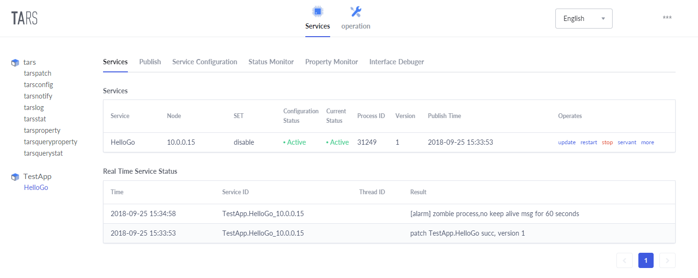
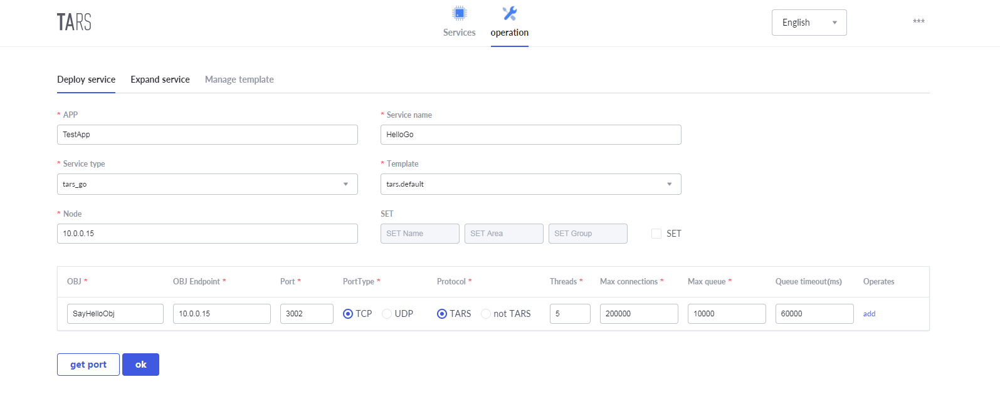
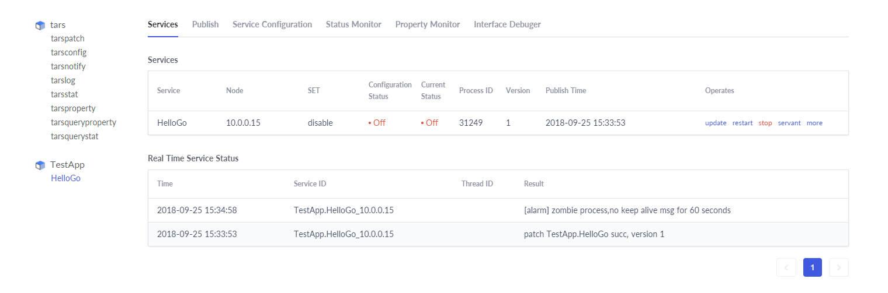
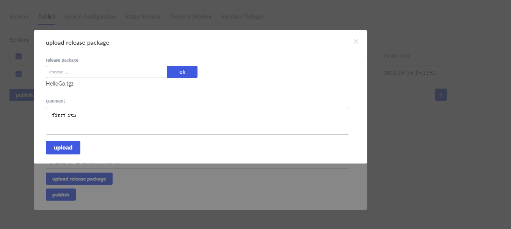
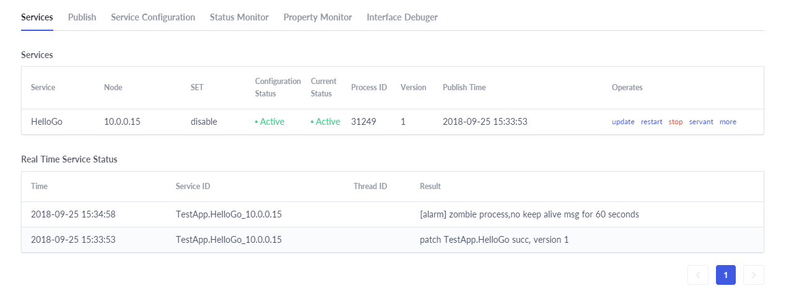

# Tars Go Quick Start

## Environment construction

Tars base component installation reference [Deploy](https://github.com/TarsCloud/Tars/tree/master/deploy)

Golang environment ready, tarsgo requires the golang version to be 1.14.x and above.。

Install tarsgo project and create scaffolding:
```shell
# < go 1.17
go get -u github.com/TarsCloud/TarsGo/tars/tools/tarsgo
# >= go 1.17
go install github.com/TarsCloud/TarsGo/tars/tools/tarsgo@latest
```

Compile the tars protocol to Golang tool:

```shell
# < go 1.17 
go get -u github.com/TarsCloud/TarsGo/tars/tools/tars2go
# >= go 1.17
go install github.com/TarsCloud/TarsGo/tars/tools/tars2go@latest
```

Check whether the tars in the GOPATH path are successfully installed.

## Service naming

Using the services of the Tars framework, the service name consists of three parts:

- APP：  The application name, which identifies a small collection of services. In the Tars system, the application name must be unique. For example: TestApp;

- Server： Service name, the name of the process providing the service. The name of the server is named according to the service function. It is generally named: XXServer, for example, HelloServer;

- Servant：A service provider that provides an interface or instance of a specific service. For example: HelloImp;

Instructions:

A Server can contain multiple Servant, and the system will use App + Server + Servant combination to define the routing name of the service in the system, called routing object. This name must be unique in the whole system, so that would uniquely identify itself when it externally served.

Therefore, when defining an App, you need pay attention to the uniqueness of the App.

For Example：TestApp.HelloServer.HelloObj.


# Tars management system

When you login successfully, you will enter the Tars management system, as shown below:

Under the menu tree of the Tars management system, the following functions are available:

- Business management: Includes deployed services, service management, release management, service configuration, service monitoring, feature monitoring, etc.
- Operation and maintenance: Includes service deployment, capacity expansion, template management, etc.

## Service deployment

Service deployment can actually be done after service development, but it is recommended to do it first.

As shown below：



- Application: Which application the service program belongs to, for example:TestApp。
- Service Name: The identification name of the service program, for example: HelloGo。
- Service type: In what language the service program is written, for example: tars_go.
- Template: The name of the configuration file that is set when the service program is started. By default, tars.default can be used.
- Node:  the machine IP of the service deployment.
- Set group: Set the Set group information of the service. The Set information includes 3 parts: Set name, Set area, and Set group name.
-  OBJ name: The name of Servant.
- OBJ Binding IP: The machine IP of the service binding, generally the same as the node
- Port: The port to which OBJ is to be bound.
- Port type: Use TCP or UDP.
- Protocol: The communication protocol used by the application layer. The Tars framework uses the tars protocol by default.
- Number of threads: The number of business processing threads.
- Maximum connections: The maximum number of connections supported.
- Maximum queue length: The size of the request receiving queue.
- Queue timeout: The timeout period for requesting the receive queue.

Click "Submit", after successful, the TestApp application under the menu number will appear the HelloServer name, and you will see the information of your new service program on the right side, as shown below:



## Service development

### Create service

Run the tarsgo scaffolding to automatically create the files necessary for the service.

```shell
tarsgo make [App] [Server] [Servant] [GoModuleName]
E.g:   
tarsgo make TestApp HelloGo SayHello github.com/Tars/test
```

After the command is executed, the code will be generated into GOPATH, and the directory will be named in `APP/Server`. The generated code also prompts the specific path.

```shell
[root@1-1-1-1 ~]# tarsgo make TestApp HelloGo SayHello github.com/Tars/test
🚀 Creating server TestApp.HelloGo, layout repo is https://github.com/TarsCloud/TarsGo.git, please wait a moment.

go: creating new go.mod: module github.com/Tars/test
go: to add module requirements and sums:
	go mod tidy

CREATED HelloGo/SayHello.tars (171 bytes)
CREATED HelloGo/SayHello_imp.go (620 bytes)
CREATED HelloGo/client/client.go (444 bytes)
CREATED HelloGo/config.conf (967 bytes)
CREATED HelloGo/debugtool/dumpstack.go (412 bytes)
CREATED HelloGo/go.mod (37 bytes)
CREATED HelloGo/main.go (517 bytes)
CREATED HelloGo/makefile (193 bytes)
CREATED HelloGo/scripts/makefile.tars.gomod (4181 bytes)
CREATED HelloGo/start.sh (56 bytes)

>>> Great！Done! You can jump in HelloGo
>>> Tips: After editing the Tars file, execute the following cmd to automatically generate golang files.
>>>       /root/gocode/bin/tars2go *.tars
$ cd HelloGo
$ ./start.sh
🤝 Thanks for using TarsGo
📚 Tutorial: https://tarscloud.github.io/TarsDocs/
```

### Defining interface files

The interface file defines the request method and the parameter field and type.  For the interface file definition rules, refer to tars_tup.md.

Just for test， we define an echoHello interface , the client request parameter is some short strings such as "tars", and the service will responds to client "hello tars".

```shell
# cat HelloGo/SayHello.tars 
module TestApp{
    interface SayHello{
        int echoHello(string name, out string greeting); 
    };
};
```

**Note**: The **out** keyword in the parameter identifies the output parameter.

### Server development

First convert the tars protocol file to the Golang language form

```shell
tars2go  -outdir=tars-protocol -module=github.com/Tars/test SayHello.tars
```

Now let's implement the logic of the server: the client sends a "name", and the server responds with the "hello name".

```shell
cat HelloGo/SayHello_imp.go
```

```go
package main
import "context"
type SayHelloImp struct {
}

func (imp *SayHelloImp) EchoHello(ctx context.Context, name string, greeting *string) (int32, error) {
    *greeting = "hello " + name
    return 0, nil
}
```

**Note**：The function name is capitalized here, and the Go language method need be exported.

Compile the main function, the initial code are generated by the tars framework.

cat HelloGo/main.go

```go
package main

import (
    "github.com/TarsCloud/TarsGo/tars"
  
    "github.com/Tars/test/tars-protocol/TestApp"
)

func main() {
    // Get server config
    cfg := tars.GetServerConfig()
  
    // New servant imp
    imp := new(SayHelloImp)
    // New servant
    app := new(TestApp.SayHello)
    // Register Servant
    app.AddServantWithContext(imp, cfg.App+"."+cfg.Server+".SayHelloObj")
  
    // Run application
    tars.Run()
}
```

Compile and build the executable and package the release.

```shell
make && make tar
```

Will generate executable file HelloGo and release package HelloGo.tgz

### Client development

```go
package main

import (
    "fmt"
  
    "github.com/TarsCloud/TarsGo/tars"
  
    "github.com/Tars/test/tars-protocol/TestApp"
)

var comm *tars.Communicator
func main() {
    comm = tars.NewCommunicator()
    obj := "TestApp.HelloGo.SayHelloObj@tcp -h 127.0.0.1 -p 10015 -t 60000"
    app := new(TestApp.SayHello)
    /*
       // if your service has been registered at tars registry
       obj := "TestApp.HelloGo.SayHelloObj"
       // tarsregistry service at 192.168.1.1:17890
       comm.SetProperty("locator", "tars.tarsregistry.QueryObj@tcp -h 192.168.1.1 -p 17890")
    */
  
    comm.StringToProxy(obj, app)
    reqStr := "tars"
    var resp string
    ret, err := app.EchoHello(reqStr, &resp)
    if err != nil {
      fmt.Println(err)
      return
    }
    fmt.Println("ret: ", ret, "resp: ", resp)
}
```

- TestApp dependencies code is generated by tars2go.。

- obj specifies the server address port. If the server is not registered at tars registry, you need to know the address and port of the server and specify it in Obj. In the example, the protocol is TCP, the server address is local address, and the port is 3002. If you have multiple servant, you can write like this `TestApp.HelloGo.SayHelloObj@tcp -h 127.0.0.1 -p 9985:tcp -h 192.168.1.1 -p 9983` so that requests can be spread across multiple servant.

  If the service has already been registered at tars registry, there is no need to write the server address and port, but you need to specify the address of the master when initializing the communicator.

- com communicator, use communicating with the server.

Build and test

```shell
# go build ./client/client.go
# ./client/client
ret:  0 resp:  hello tars 
```


### HTTP service development

Tarsgo supports http service, follow the steps above to create a service, tarsgo processing http request is encapsulated in GO native net/http, so the usage is very simple.

```go
package main

import (
    "net/http"
    "github.com/TarsCloud/TarsGo/tars"
)

func main() {
    mux := &tars.TarsHttpMux{}
    mux.HandleFunc("/", func(w http.ResponseWriter, r *http.Request) {
      w.Write([]byte("Hello tars"))
    })
    cfg := tars.GetServerConfig()
    tars.AddHttpServant(mux, cfg.App+"."+cfg.Server+".HttpSayHelloObj") //Register http server
    tars.Run()
}
```

In addition, you can directly call other tars services, the same as the "client development" mentioned.

## Service release

In the menu tree of tars management system, find the service you deployed and click to enter the service page.

Select "Publish Management", select the node to be published, click "Publish Selected Node", click "Upload Release Package", select the released package, as shown below:



After uploading the distribution package, click on the "Select Release Version" drop-down box and the service program you uploaded will appear. Select the top one (latest uploaded).

Click "Publish", the service starts to be released, after the release is successful, the following interface appears, as shown below:




